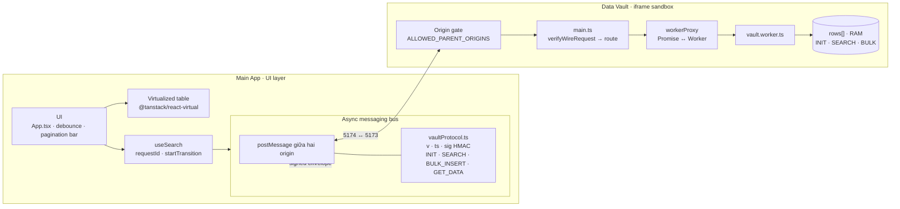
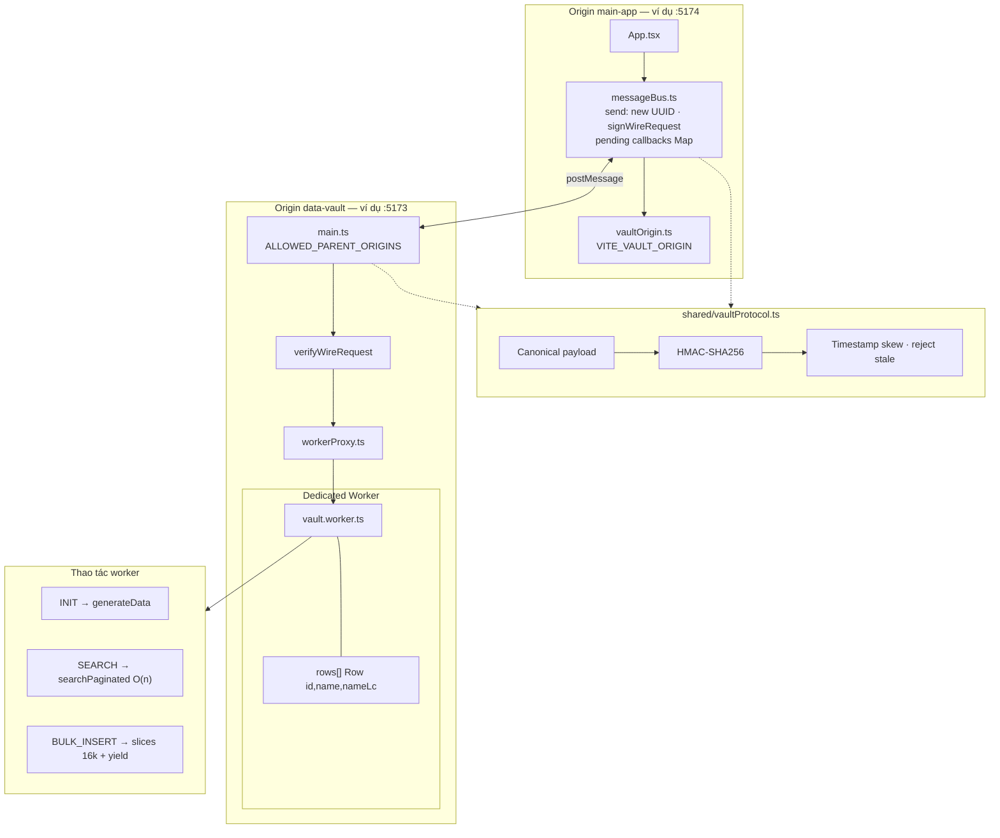
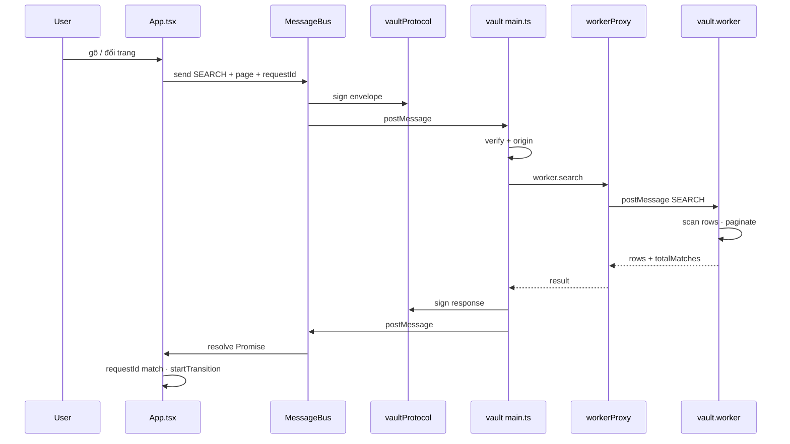

# Kiến trúc tổng quan (dễ đọc)

**Lưu ý:** **`rows[]`** trong Web Worker là nguồn đọc/ghi; sau **bulk insert**, snapshot được **IndexedDB** để không mất khi reload iframe.

---

## Sơ đồ tổng thể (3 vùng)

---

## Sơ đồ chi tiết (mapping file & luồng RPC)

---

## Ranh giới & bus (đọc nhanh)

| Khái niệm | Trong code |
|-----------|------------|
| **Secure boundary** | Hai **origin**; không shared heap; vault chỉ tin **parent** trong allowlist + tin **đã verify** trước khi gọi worker. |
| **Bus** | Không process riêng — **`window.postMessage`** + envelope có **ký** (`signWireRequest` / `verifyWireResponse`). |
| **RPC id** | Main-app: **`id`** mỗi `send()`; hook search thêm **`requestId`** trong payload để UI bỏ qua response cũ. |
| **Storage** | **`rows[]`** trong worker — reload iframe = mất state (trừ khi INIT/bulk lại). |

---

## Luồng SEARCH (một vòng)

Chi tiết quyết định kỹ thuật: [../DECISION_LOG.md](../DECISION_LOG.md).
